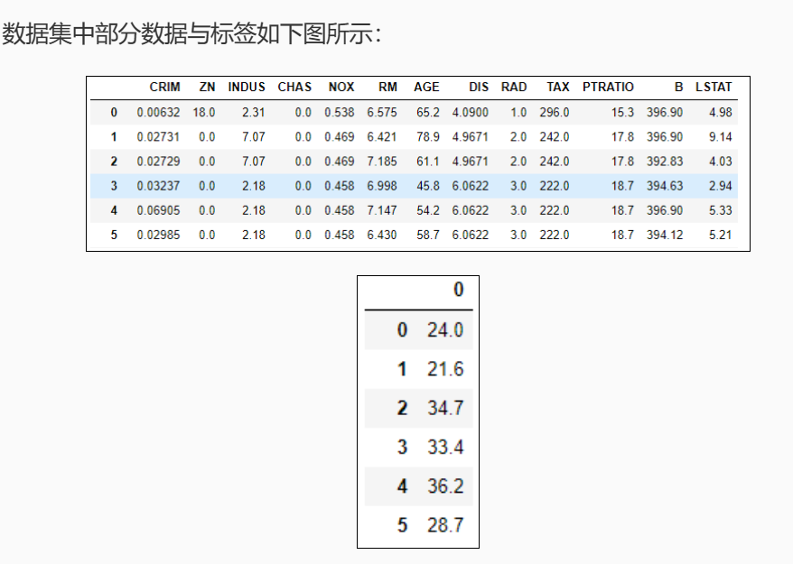
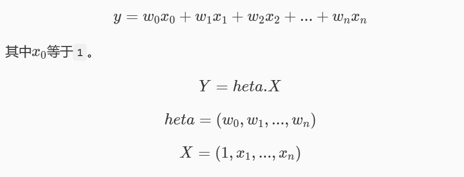

任务描述
本关任务：根据本关卡所学知识，构建线性回归算法，并利用波斯顿房价数据对模型进行训练，然后对未知的房价数据进行预测。

相关知识
为了完成本关任务，你需要掌握：1.线性回归训练流程，2.线性回归的正规方程解。

数据集介绍
波斯顿房价数据集共有506条波斯顿房价的数据，每条数据包括对指定房屋的13项数值型特征和目标房价组成。用数据集的80%作为训练集，数据集的20%作为测试集，训练集和测试集中都包括特征和目标房价。

sklearn中已经提供了波斯顿房价数据集的相关接口，想要使用该数据集可以使用如下代码：

```python
from sklearn import datasets
#加载波斯顿房价数据集
boston = datasets.load_boston()
#X表示特征，y表示目标房价
X = boston.data
y = boston.target
```



线性回归训练流程
由数据集可以知道，每一个样本有13个特征与目标房价，而我们要做的事就是通过这13个特征来预测房价，我们可以构建一个多元线性回归模型，来对房价进行预测。模型如下：

$$
y=b+w_1x_1+w_22x_2+...+w_nx_n
$$

其中$x_i$ 表示第i个特征值，$w_i$表示第i个特征对应的权重，b表示偏置，y表示目标房价。

为了方便，我们稍微将模型进行变换：



而我们的目的就是找出能够正确预测的多元线性回归模型，即找出正确的参数heta。那么如何寻找呢？通常在监督学习里面都会使用这么一个套路，构造一个损失函数，用来衡量真实值与预测值之间的差异，然后将问题转化为最优化损失函数。既然损失函数是用来衡量真实值与预测值之间的差异那么很多人自然而然的想到了用所有真实值与预测值的差的绝对值来表示损失函数。不过带绝对值的函数不容易求导，所以采用MSE(均方误差)作为损失函数，公式如下：


其中p表示预测值，y表示真实值，m为样本总个数，i表示第i个样本。最后，我们再使用正规方程解来求得我们所需要的参数。

线性回归模型训练流程如下：

线性回归的正规方程解
对线性回归模型，假设训练集中m个训练样本，每个训练样本中有n个特征，可以使用矩阵的表示方法，预测函数可以写为：

Y=hetaX

其损失函数可以表示为

(Y−hetaX)^T(Y−hetaX)

其中，标签Y为mx1的矩阵，训练特征X为mx(n+1)的矩阵，回归系数heta为(n+1)x1的矩阵，对heta求导，并令其导数等于0，可以得到X^T (Y−hetaX)=0。所以，最优解为：

heta=(XTX)−1 XT Y

这个就是正规方程解，我们可以通过最优方程解直接求得我们所需要的参数。

编程要求
根据提示，在右侧编辑器补充 Python 代码，实现线性回归算法与MSE损失函数计算方法，并利用房价数据对模型进行训练，然后对未知的房价数据进行预测。

函数说明
numpy方法：
numpy.mean(array, axis)
指定轴上数组元素计算算术平均数。

```numpy.mean([
      [4,5,6],
      [7,8,9]],axis=0)
[4. 5. 6.]
```

numpy.ones(shape)
返回一个包含给定形状和数据类型的新数组。

```
numpy.ones([3, 3])
[[1. 1. 1.]
[1. 1. 1.]
[1. 1. 1.]]
```


按水平方向（列顺序）堆叠数组构成一个新的数组。

numpy.hstack(([1,2,3],[4,5,6]))
[1 2 3 4 5 6]
numpy.vstack((a, b))
按垂直方向（行顺序）堆叠数组构成一个新的数组。

numpy.vstack(([1,2,3],[4,5,6]))
[[1 2 3]
[4 5 6]]
numpy线性代数方法：
numpy.linalg.inv(m)
返回 m 的逆矩阵

numpy.linalg.inv([[2,5],[1,3]])
[[ 3. -5.]
[-1.  2.]]
numpy.dot(m1, m2)
矩阵 m1 与矩阵 m2 点乘。

numpy.dot([[2,5],[1,3]], [[3,-5],[-1,2]])
[[1 0]
[0 1]]
m.T
矩阵 m 的转置矩阵。

m = np.array([[2,5],[1,3]])
m.T
[[2 1]
[5 3]]
测试说明
只需返回预测结果即可，程序内部会检测您的代码，MSE低于30则视为过关。

开始你的任务吧，祝你成功！
